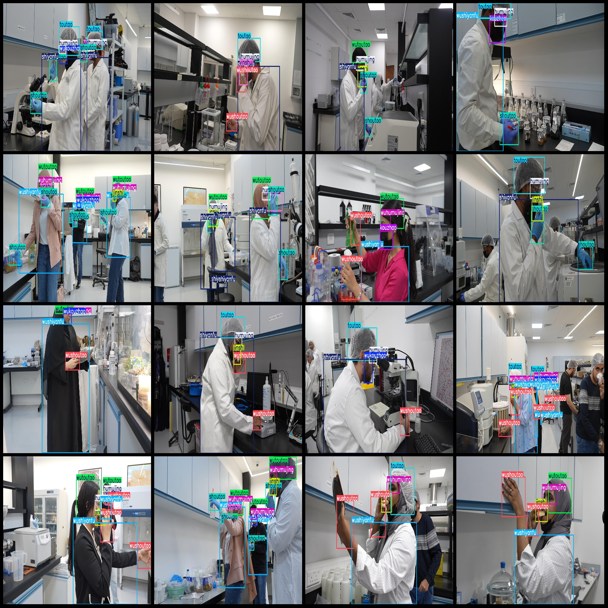
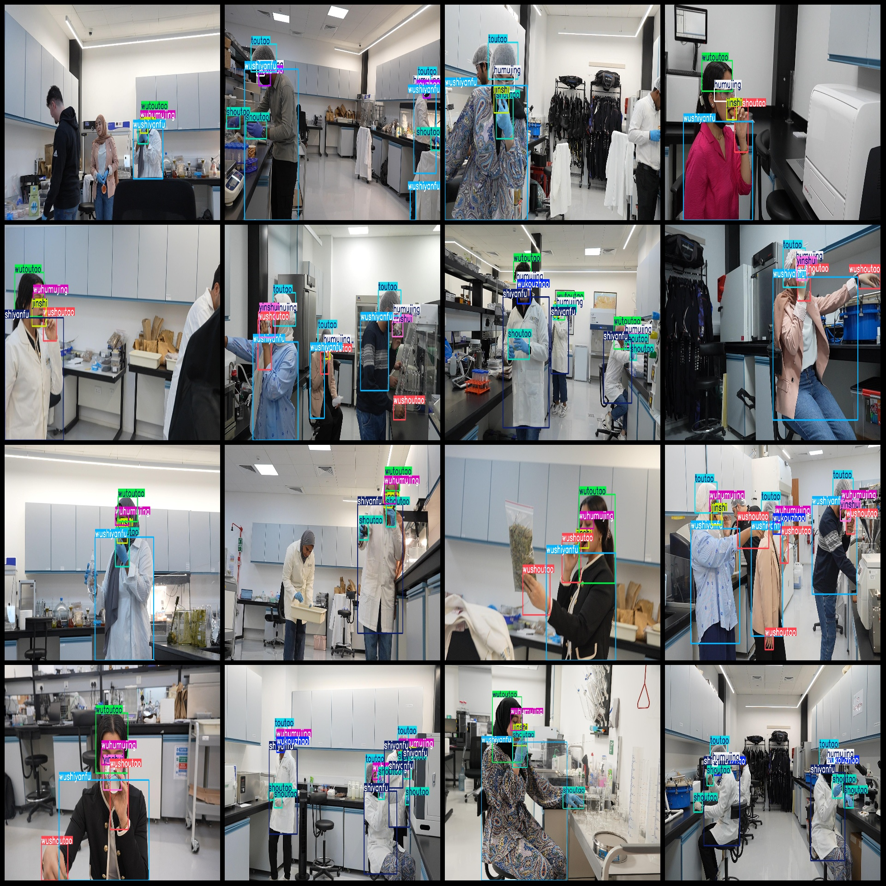

# Laboratory Operations Safety Standards and Detection Data Set VOC + YOLO Format 7122 Images with 12 Categories

Dataset format: Pascal VOC format + YOLO format (without split path in txtfile, only containing jpgimage and corresponding VOC format xmlfile and yolo format txtfile)
number of images: 7122  
annotation count: 7122  
annotation count: 7122  
annotationnumber of classes: 12  
Annotation class names: ["1. goggles", "2. eat", "3. mask", "4. lab coat", "5. gloves", "6. headgear", "7. no goggles", "8. no mask", "9. no lab coat", "10. no gloves", "11. no headgear", "12. drink"]
Corresponding Chinese class names: ["_eyewear", "_meal", "_mask", "_labgear", "_gloves", "_headset", "_no_eyewear", "_no_mask", "_no_labgear", "_no_gloves", "_no_headset", "_water"]
boxes per class:   
humujing box count = 4822  
jinshi box count = 2966  
kouzhao box count = 1694  
shiyanfu box count = 4976  
shoutao box count = 7248  
toutao box count = 4591  
wuhumujing box count = 4604  
Frame count = 1702  
Frame count = 4868  
Frame count = 7573  
Frame count = 4733  
Frame count = 2967  
Total frames: 52744  
Each category has images:  
Humujing has images = 3692  
Jinshi has images = 2946  
Kouzhao has images = 1555  
Shiyanfu has images = 3542  
Shoutao has images = 3417  
Toutao has images = 3403  
Wuhumujing has images = 3386  
Wukouzhao has images = 1556
"wushiyanfu" is a Chinese character. Its English translation is "wasiyanfu."
"wushoutao images = 3616" is written in Chinese, which means "Wushoutao has 3616 pictures."
Wutoutao owns 3694 pictures.
yinshui images = 2830  
image resolution: 1920x1080  
Use annotation tool: labelImg  
Annotation rules: draw a rectangle around the class.
Important Note: The dataset needs to be split into training, validation, and test sets, which should be done by yourself.
Special Statement: This dataset does not guarantee the accuracy of the trained model or weight file.
Preview of the image:
## Images

Here is a pay link on Stripe ( https://buy.stripe.com/3cs8yP7sY87d0vu9AB ). Please contact me lonlonago@foxmail.com after funding $89, and I will send you a complete data files , thank you!

